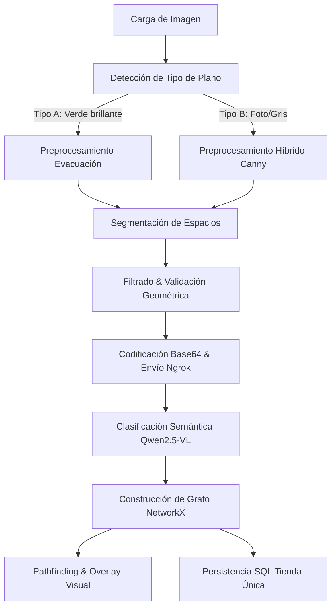

# Documentación Técnica Detallada: Pipeline de Evacuación Floorplan V2

Este documento sirve como especificación técnica completa y guía de explicación del pipeline de análisis de planos arquitectónicos implementado en el sistema. Combina técnicas avanzadas de **Visión Computacional Clásica (OpenCV)**, **Teoría de Grafos (NetworkX)**, y **Modelos Multimodales de Inteligencia Artificial (Qwen2.5-VL 7B)** expuestos a través de un túnel HTTP de Ngrok.

---

## 1. Arquitectura Híbrida del Sistema

El pipeline resuelve un problema complejo: **convertir una imagen de un plano plano (2D) en un modelo digital navegable estructurado (grafo topológico)**.



El sistema opera bajo un enfoque híbrido:
* **Fronteras y Geometría (OpenCV)**: La visión clásica es extremadamente precisa para calcular centroides, bounding boxes y contornos a nivel de píxel.
* **Semántica y Relaciones (Qwen2.5-VL)**: Los modelos de lenguaje visual (VLM) comprenden la distribución lógica del espacio, leen texto (OCR integrado), identifican el tipo de cuarto (oficina, pasillo, baño) e infieren la conectividad de las puertas.

---

## 2. Flujo de Procesamiento Detallado (`FloorPan` en `floopan.py`)

### 2.1. Carga de la Imagen
El método `load_image(file)` inicializa la carga del archivo utilizando la librería `PIL` (Python Imaging Library), garantizando la compatibilidad con múltiples formatos (PNG, JPG, BMP).

### 2.2. Detección Automática de Tipo de Plano
Para soportar planos estilizados y fotografías de planos con diferentes calidades, el método `_detect_plan_type` analiza el espacio de color **HSV**:
* Extrae el total de píxeles de la imagen: $\text{Total} = \text{Ancho} \times \text{Alto}$.
* Genera una máscara de color verde saturado usando los umbrales:
  * Rango Mínimo: `[38, 70, 100]`
  * Rango Máximo: `[85, 255, 255]`
* Calcula el ratio:
  $$\text{Ratio} = \frac{\sum(\text{Píxeles verdes})}{\text{Total}}$$
* **Clasificación**:
  * Si $\text{Ratio} > 0.05$ ($5\%$ de la imagen): **Tipo A (`green_walls`)**. Es un plano de evacuación clásico con paredes verdes saturadas y fondo blanco.
  * Si $\text{Ratio} \le 0.05$: **Tipo B (`gray_photo`)**. Es una imagen de plano regular, plano de obra o fotografía con muros grises.

---

### 2.3. Preprocesamiento Morfológico de Paredes
El objetivo de esta fase es generar una **máscara binaria limpia de paredes** (`walls_mask`), donde el blanco (255) representa muros infranqueables y el negro (0) representa espacio transitable.

#### **Algoritmo para Tipo A (`_preprocess_green_walls`)**
1. **Paredes Exteriores**: Se extrae la máscara verde brillante en el canal HSV.
2. **Paredes Internas**: Se filtran los píxeles grises en escala de grises cuyo brillo esté en el rango $[90, 205]$, removiendo el solapamiento con la máscara verde.
3. **Consolidación**: Se realiza una operación lógica `OR` (`bitwise_or`) entre paredes internas y externas.
4. **Cierre Morfológico**: Se aplica `cv2.morphologyEx` con una operación `MORPH_CLOSE` usando un kernel rectangular de $4\times4$ durante $3$ iteraciones para sellar pequeñas grietas, y finalmente se dilata (`cv2.dilate`) con el mismo kernel para rellenar discontinuidades.

#### **Algoritmo para Tipo B (`_preprocess_gray_photo`)**
1. **Filtro de Contraste**: Invierte la escala de grises aplicando un umbral binario invertido a $148$ (`THRESH_BINARY_INV`) para aislar los muros oscuros.
2. **Remoción de Zonas de Color**: Para evitar que las leyendas o zonas coloreadas (rutas rojas/azules) se fusionen con las paredes, se restan del cálculo los canales Rojo y Azul dominantes:
   * Píxel Rojo: $R - B > 12 \land R - G > 8 \land R > 100$
   * Píxel Azul: $B - R > 10 \land B > G \land B > 100$
   Se ponen a 0 (negro) estas coordenadas en la máscara de paredes.
3. **Canny Edge Detection**: Aplica un filtro gaussiano de $3\times3$ y ejecuta el detector Canny con umbral inferior 20 y superior 60 para capturar bordes finos.
4. **Dilatación y Cierre**: Aplica dilatación con kernel $3\times3$ (3 iteraciones) y cierre morfológico con kernel de $5\times5$ (3 iteraciones). Finalmente une ambos resultados (`bitwise_or`) para obtener una red compacta de paredes.

---

### 2.4. Segmentación y Detección de Cuartos (`detect_rooms`)
Se invierte la máscara de paredes (`bitwise_not`) para que las áreas transitables sean blancas.

#### **Algoritmo para Tipo A (`_detect_rooms_green`)**
1. Aplica una erosión morfológica con kernel de $4\times4$ (2 iteraciones) para encoger ligeramente los espacios. Esto desconecta habitaciones que comparten bordes muy finos o umbrales estrechos, evitando que se detecten como una sola habitación gigante.
2. Encuentra contornos jerárquicos usando `cv2.findContours` con el modo `RETR_CCOMP` y aproximación simple.
3. Envía cada contorno al motor de evaluación `_eval_contour`.

#### **Algoritmo para Tipo B (`_detect_rooms_gray`)**
1. **Segmentación de Zonas de Color**:
   * Genera máscaras exclusivas para los píxeles rojos y azules saturados.
   * Aplica un cierre morfológico grande de $9\times9$ (4 iteraciones) y una dilatación de $9\times9$ (2 iteraciones) para rellenar y unificar las áreas coloreadas.
   * Encuentra contornos en estas máscaras de color (`cnts_red` y `cnts_blue`).
2. **Segmentación de Zonas Grises**:
   * Invierte la máscara de paredes y aplica erosión con un kernel de $5\times5$ (1 iteración).
   * Encuentra los contornos grises normales.
3. **Unificación Jerárquica**:
   * Evalúa primero los contornos rojos y luego los azules (mayor prioridad semántica), asignándoles las etiquetas `zone_red` y `zone_blue`.
   * Finalmente evalúa los contornos grises normales (etiqueta `gray`), deduplicándolos contra los centroides ya registrados de las zonas de color para evitar solapamientos.

#### **Motor de Validación Geométrica: `_eval_contour`**
Cada contorno detectado debe pasar filtros estrictos para ser considerado un cuarto válido:
1. **Área Proporcional**: El área del contorno en píxeles debe ser mayor al $0.3\%$ del área total de la imagen (excluye ruido) y menor al $50\%-55\%$ (evita capturar el plano completo).
2. **Exclusión de Bordes**: Si la caja delimitadora (`bbox`) del contorno está a menos de $15$ px de los bordes físicos de la imagen, se descarta (evita detectar la calle o zonas exteriores del mapa).
3. **Aspect Ratio**: Filtra pasillos excesivamente largos o cables que pasaron el umbral. La relación de aspecto máxima permitida es de $8$ para planos verdes y $12$ para planos de fotos.
4. **Deduplicación Espacial**: Si el centroide de un nuevo contorno $(cx, cy)$ está a menos de $55$ píxeles de cualquier centroide ya aceptado, se descarta inmediatamente por redundancia.
5. **Simplificación Geométrica**: Aplica el algoritmo Douglas-Peucker (`cv2.approxPolyDP`) con un factor de tolerancia del $2\%$ del perímetro para simplificar el contorno en un polígono de pocos vértices.

---

### 2.5. Clasificación Semántica Remota (`classify_rooms_with_ai`)
Para evitar sobrecargar el servidor local del cliente (o en entornos sin GPU compatible), la inferencia visual se delega a un servidor remoto que corre el modelo **Qwen2.5-VL 7B** a través de un túnel seguro HTTP de Ngrok.

1. **Payload**:
   * `image_base64`: La imagen del plano original codificada en formato Base64.
   * `rooms_data`: Una lista simplificada de diccionarios que contiene `id`, `area`, `centroid`, `bbox` y su respectivo `color_tag` (`zone_red`, `zone_blue`, `gray`).
2. **Petición**:
   Se realiza un `POST` a la dirección configurada en `NGROK_ENDPOINT` (ruta `/classify-rooms`).
3. **Procesamiento en Servidor de IA**:
   El servidor recibe el Base64, lo decodifica a bytes de imagen y genera un prompt dinámico detallado:
   * Proporciona la lista de habitaciones detectadas con su ubicación y etiquetas de color.
   * Instruye a Qwen2.5-VL a mapear visualmente cada región con el texto visible (OCR) y su contexto para asignarle un nombre real en español (ej. *"Sala de Juntas B"*, *"Pasillo Principal"*).
   * Clasifica el tipo funcional: `office`, `meeting_room`, `bathroom`, `hallway`, `reception`, `storage`, `staircase`, `open_space` u `other`.
   * Deduce la conectividad lógica de paso (puertas) basándose en la imagen original.
   * Estima los metros cuadrados (`estimated_sqm`) del espacio.
4. **Respuesta**:
   El servidor remoto responde con la salida estructurada de la IA, la cual es procesada localmente mediante un parseador robusto (`_safe_parse`) que extrae el JSON limpio eliminando bloques de código markdown.
5. **Robustez de Caídas (Fallback)**:
   Si el servidor de IA falla, no responde, o la IA omite algún ID de habitación, un ciclo automático genera un objeto de respaldo para ese ID omitido (nombre genérico, tipo basado en su color de zona, y metros cuadrados calculados proporcionalmente a su área de píxeles: $\text{sqm} = \text{area\_px} / 400$).

---

### 2.6. Construcción y Teoría del Grafo (`build_floor_graph`)
Utiliza la librería **NetworkX** para modelar la topología de navegación:

* **Nodos**: Cada habitación representa un nodo. Almacena propiedades físicas de OpenCV (`centroid`, `bbox`, `area_px`) y propiedades semánticas (`name`, `type`, `sqm`).
* **Aristas (Conexiones)**:
  * **Puertas (AI)**: Conexiones declaradas por la IA (peso = 1.0, tipo = `door`).
  * **Proximidad Física (OpenCV Fallback)**: Para garantizar que el grafo sea conexo (especialmente en pasillos), calcula la distancia euclidiana entre todos los centroides aceptados. Si hay $\ge 2$ nodos, calcula la distancia media de todos los pares.
  * Si la distancia entre dos nodos es inferior a una tolerancia estricta del **$45\%$ de la distancia promedio** (umbral de proximidad), se traza una arista de tipo `proximity` con peso igual a la distancia normalizada (`distancia / 100`).

### 2.7. Pathfinding (Navegación de Rutas)
El método `find_route` utiliza el algoritmo **Dijkstra** implementado en NetworkX (`nx.shortest_path`) ponderado por la propiedad de peso (`weight`) de las aristas. Recibe el nombre de la habitación de origen y destino, busca sus respectivos nodos y devuelve el camino óptimo como una secuencia de IDs y nombres de habitaciones transitables.

---

### 2.8. Overlay y Renderizado Visual (`overlay_on_image`)
Para fines de depuración y visualización en el frontend:
1. Pinta el contorno de cada habitación con un color de relleno según su clasificación funcional con un $28\%$ de opacidad sobre la imagen original utilizando `cv2.addWeighted`.
2. Dibuja las aristas de navegación: líneas gruesas de color naranja para puertas y cian para proximidad espacial.
3. Dibuja los nodos como círculos concéntricos de color blanco y color funcional.
4. Escribe el nombre de la habitación centrado con un fondo rectangular negro opaco para garantizar la legibilidad en cualquier color de fondo del plano.

---

## 3. Integración del Servicio y Base de Datos (`FloorpanV2Service`)

El servicio coordina la API y la interacción transaccional con la base de datos PostgreSQL:

### 3.1. Cola Temporal de Archivos (`queqe`)
Debido a que `UploadFile` de FastAPI es un stream binario en memoria/temporal y no puede ser serializado por Celery, el controlador escribe el archivo temporalmente en la carpeta `images/floorplan/queqe/` bajo un identificador único. Posteriormente, el servicio lee los bytes del archivo en el hilo de ejecución asíncrono y en el bloque `finally` elimina el archivo de forma segura.

### 3.2. Modelo de Tienda Única
A diferencia de versiones anteriores, el servicio persiste **únicamente un registro central de Tienda** en la base de datos para todo el plano procesado (ej. *"Metro Cencosud"*), en lugar de poblar la tabla con decenas de filas para cada nodo de la imagen.

* **Grafo Integrado**: Los nodos (IDs, nombres, centroides, sqm) y las aristas (conexiones, pesos) se estructuran en un JSON completo y se guardan directamente en la columna `grafo` (`jsonb`) del registro de la tienda.
* **Resolución del Plano**: Se guardan el ancho y alto originales de la imagen en las columnas `ancho` y `alto` del registro para que el frontend pueda escalar y dibujar correctamente el grafo vectorizado sobre la imagen renderizada.
* **Coordenadas de Google Maps**: Se crean columnas específicas de base de datos `latitud` y `longitud` (tipo `float`), las cuales se configuran inicialmente como `None` (vacías) ya que la IA del plano no conoce la ubicación satelital del negocio.
* **Relaciones Automáticas**: El servicio busca productos cuya columna `vendido_por` coincida de manera insensible a mayúsculas con el nombre del plano y los asocia automáticamente a través de la tabla relacional `producto_tienda`.

---

## 4. Endpoints y Especificación de la API

### 4.1. POST `/api/v2/floorplan/analyze`
* **Tipo**: Multipart Form Data.
* **Payload**: `file` (archivo de imagen).
* **Acción**: Guarda la imagen en `/queqe/` y retorna inmediatamente el ID de la tarea asíncrona de Celery.
* **Respuesta**:
  ```json
  {
    "status": "processing",
    "message": "El análisis del plano se está procesando en segundo plano.",
    "task_id": "c71a39f6-17b5-4b47-8a60-399fa51821cf"
  }
  ```

### 4.2. GET `/api/v2/floorplan/result/{task_id}`
* **Acción**: Consulta el estado de procesamiento del plano en Celery.
* **Respuesta (Procesando)**:
  ```json
  {
    "status": "processing",
    "message": "El análisis del plano aún se está procesando.",
    "data": null
  }
  ```
* **Respuesta (Completado con Éxito)**:
  ```json
  {
    "status": "success",
    "message": "El análisis del plano se ha completado.",
    "data": {
      "nodes": [
        {
          "id": 0,
          "name": "Oficina A",
          "type": "office",
          "area": 15400.0,
          "centroid": [120, 240],
          "sqm": 35.0
        }
      ],
      "edges": [
        {
          "source": 0,
          "target": 1,
          "weight": 1.0,
          "connection_type": "door"
        }
      ],
      "summary": {
        "plan_type": "green_walls",
        "total_nodes": 12,
        "total_edges": 15,
        "rooms": 8,
        "corridors": 2,
        "open_spaces": 2
      },
      "visualization_url": "/images/floorplan/result_v2_f839d8c.png",
      "debug_url": "/images/floorplan/debug_482d9f.png",
      "width": 1024,
      "height": 768
    }
  }
  ```

### 4.3. GET `/api/stores/`
* **Acción**: Devuelve todas las tiendas del sistema con su grafo y dimensiones.
* **Respuesta**:
  ```json
  {
    "status": "success",
    "message": "Tiendas listadas exitosamente",
    "data": [
      {
        "tiendaId": 1,
        "nombre": "Plaza Vea Sagitario",
        "latitud": null,
        "longitud": null,
        "nodo_id": null,
        "ancho": 1024,
        "alto": 768,
        "grafo": {
          "nodes": [...],
          "edges": [...]
        }
      }
    ]
  }
  ```

### 4.4. PATCH `/api/stores/{store_id}/location`
* **Acción**: Modifica las coordenadas GPS de Google Maps para una tienda específica.
* **Payload**:
  ```json
  {
    "latitud": -12.14658,
    "longitud": -76.98921
  }
  ```
* **Respuesta**:
  ```json
  {
    "status": "success",
    "message": "Ubicación de la tienda actualizada exitosamente",
    "data": {
      "tiendaId": 1,
      "nombre": "Plaza Vea Sagitario",
      "latitud": -12.14658,
      "longitud": -76.98921,
      "nodo_id": null,
      "ancho": 1024,
      "alto": 768,
      "grafo": { ... }
    }
  }
  ```
